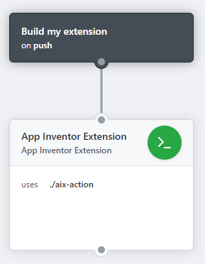

# AIX-Action

## How to use

1. Place your extension source into `src` dir in the root of the git repository.
2. Create a new workflow by going into the "Actions" tab.

    ```hcl
    workflow "Build my extension" {
      resolves = ["Publish AIX"]
      on = "release"
    }

    action "Build AIX" {
      uses = "pavi2410/AIX-Action@master"
    }

    # OPTIONAL
    action "Publish AIX" {
      uses = "JasonEtco/upload-to-release@master"
      needs = ["Build AIX"]
      secrets = ["GITHUB_TOKEN"]
      args = "/github/workspace/appinventor-sources/appinventor/components/build/extensions/tk.pavi2410.aix application/zip"
    }
    ```
    
    
3. Now, whenever you push a commit, the extension will be built automatically and can be located at `/github/workspace/appinventor-sources/appinventor/components/build/extensions/`
